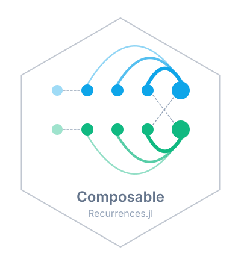

# ComposableRecurrences 

<!-- badges:start -->
| **Documentation** | **Build Status** | **Code Quality** | **License & DOI** | **Downloads** |
|:-----------------:|:----------------:|:----------------:|:-----------------:|:-------------:|
| [](https://epiaware.org/ComposableRecurrences.jl/stable/) [](https://epiaware.org/ComposableRecurrences.jl/dev/) | [](https://github.com/EpiAware/ComposableRecurrences.jl/actions/workflows/test.yaml) [](https://codecov.io/gh/EpiAware/ComposableRecurrences.jl) [](https://github.com/EpiAware/ComposableRecurrences.jl/actions/workflows/ad.yaml) | [](https://github.com/fredrikekre/Runic.jl) [](https://github.com/JuliaTesting/Aqua.jl) [](https://github.com/aviatesk/JET.jl) | [](https://opensource.org/licenses/MIT) | [](https://juliapkgstats.com/pkg/ComposableRecurrences) [](https://juliapkgstats.com/pkg/ComposableRecurrences) |

| ForwardDiff | ReverseDiff (tape) | ReverseDiff (compiled) | Enzyme forward | Enzyme reverse | Mooncake reverse | Mooncake forward |
|:---:|:---:|:---:|:---:|:---:|:---:|:---:|
| [](https://app.codecov.io/gh/EpiAware/ComposableRecurrences.jl?flags%5B0%5D=ad-forwarddiff) | [](https://app.codecov.io/gh/EpiAware/ComposableRecurrences.jl?flags%5B0%5D=ad-reversediff) | [](https://app.codecov.io/gh/EpiAware/ComposableRecurrences.jl?flags%5B0%5D=ad-reversediff-compiled) | [](https://app.codecov.io/gh/EpiAware/ComposableRecurrences.jl?flags%5B0%5D=ad-enzyme-forward) | [](https://app.codecov.io/gh/EpiAware/ComposableRecurrences.jl?flags%5B0%5D=ad-enzyme-reverse) | [](https://app.codecov.io/gh/EpiAware/ComposableRecurrences.jl?flags%5B0%5D=ad-mooncake-reverse) | [](https://app.codecov.io/gh/EpiAware/ComposableRecurrences.jl?flags%5B0%5D=ad-mooncake-forward) |
<!-- badges:end -->

Fast, composable and differentiable recurrences and causal convolutions in Julia.

> [!NOTE]
> ComposableRecurrences is under development and not yet registered.
> Its API may change.

## Why ComposableRecurrences?

- Renewal processes, random walks, autoregressions and reporting delays are usually separate hand-written loops.
  Here each is a `Recurrence` or a `Convolution`, so one pair of operators covers them all.
- Kernels are lag first, as a generation interval or a set of AR coefficients is written, and can differ by stratum or change over time.
  A time-varying delay can be indexed by the day of the primary event or by the day it is observed.
- Strata couple through any `S × S` matrix (dense, sparse or `Diagonal`), a time-varying matrix, or a pairwise kernel with its own lags.
  A spatial or multi-group model uses the same operator as a single series.
- Modifiers act on each step in the order given and carry their own state.
  An effect such as susceptible depletion is one small type with an `apply!` method, not a new loop.
- A call can return its state, and the next call resumes from it, so a forecast continues a fitted series without rebuilding the operator.
- No step copies its lag window, so gradients stay fast.
  They are tested against ForwardDiff, Mooncake and Enzyme.
- Interface tests check that a user-written operator, modifier or coupling meets the contract.

## Getting started

Once released, see the [documentation](https://epiaware.org/ComposableRecurrences.jl/stable/) for a full walkthrough.

```julia
using ComposableRecurrences
```

## Related packages

- [ComposableTuringIDModels.jl](https://composableturingidmodels.epiaware.org) builds infectious disease models from renewal, delay and latent process steps of the kind this package runs.

## Where to learn more

- [GitHub Discussions](https://github.com/EpiAware/ComposableRecurrences.jl/discussions)
- [GitHub Repository](https://github.com/EpiAware/ComposableRecurrences.jl)

<!-- standard-sections:start -->
<!-- MANAGED by EpiAwarePackageTools.scaffold — do not edit between the
     markers. These standard sections are re-rendered on every update;
     edit the package-owned sections outside them, or CITATION.cff. -->

## Contributing

We welcome contributions and new contributors! Please open an issue or pull request on [GitHub](https://github.com/EpiAware/ComposableRecurrences.jl). This package follows [ColPrac](https://github.com/SciML/ColPrac) and is formatted with [Runic](https://github.com/fredrikekre/Runic.jl).

## How to cite

If you use ComposableRecurrences in your work, please cite it. Citation metadata lives in [`CITATION.cff`](https://github.com/EpiAware/ComposableRecurrences.jl/blob/main/CITATION.cff), which GitHub renders as a "Cite this repository" button on the repository page.

## Code of conduct

Please note that the ComposableRecurrences project is released with a [Contributor Code of Conduct](https://github.com/EpiAware/.github/blob/main/CODE_OF_CONDUCT.md). By contributing, you agree to abide by its terms.
<!-- standard-sections:end -->
