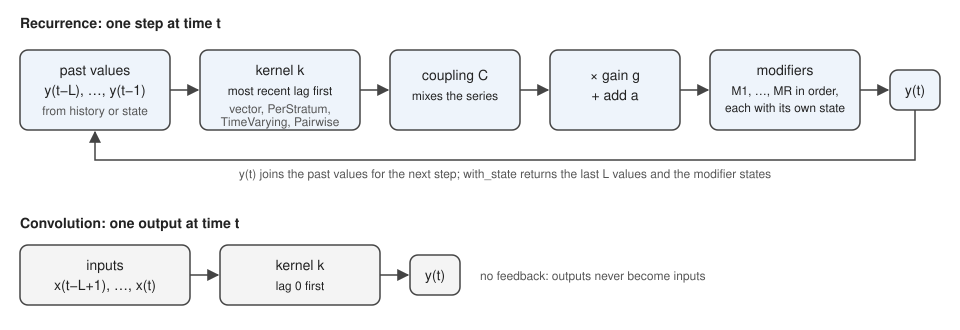

# [API overview](@id api-overview)

A recurrence steps a series forward from its own past values.
A convolution weights past inputs.
Both take a kernel, and a recurrence also takes a coupling and modifiers.



For each time ``t`` from `start` to `stop`, a recurrence computes

```math
\begin{aligned}
p_t &= \sum_{l=1}^{L} k_l \, y_{t-l} \\
v_t &= g_t \odot C_t \, p_t + a_t \\
y_t &= M_R \circ \dots \circ M_1 (v_t)
\end{aligned}
```

and a convolution computes

```math
y_t = \sum_{l=0}^{L-1} k_l \, x_{t-l} .
```

- ``y_t`` is the output and ``x_t`` the convolution input; each has one entry per series.
- ``k_l`` is the [kernel](@ref overview-shapes) weight on lag ``l``.
- ``C_t`` is the [coupling](@ref overview-couplings), which mixes the series.
- ``g_t`` is the gain and ``a_t`` the additive input, the arguments `gain` and `add` of the [call](@ref overview-calls).
- ``M_1, \dots, M_R`` are the [modifiers](@ref overview-modifiers), each with its own state carried from step to step.
- ``\odot`` multiplies element by element.

Names that are public but not exported are written unqualified below.
Load them with `using ComposableRecurrences: Depletion, Floor, with_state`, and so on.
For models from infectious disease epidemiology, see [Infectious disease models](@ref infectious-disease-models).

## Words used on these pages

- **Series**: one sequence of values over time, such as the infections in one region or age group.
- **Stratum** (plural strata): one of several series run side by side, which `PerStratum` gives its own value.
- **Kernel**: the weights applied to past values, listed from the most recent lag.
- **Gain**: the multiplier ``g_t`` on each step, such as the reproduction number in a renewal process.
- **History**: the values before the first step.
- **State**: the values a later call needs to continue a series, as described under [Calls](@ref overview-calls).
- **Pointwise**: acting on each series separately.

## Tables

Each table below lists one part of the package:
[operators](@ref overview-operators),
[calls](@ref overview-calls),
[shapes](@ref overview-shapes),
[couplings](@ref overview-couplings),
[modifiers](@ref overview-modifiers),
[depletion forms and indexing](@ref overview-variants),
[time-series processes](@ref overview-time-series),
[extending](@ref overview-extending) and
[checking gradients](@ref overview-gradients).

## [Operators](@id overview-operators)

| Name | What it does | Returns |
|---|---|---|
| [`Recurrence(kernel; coupling, modifiers)`](@ref Recurrence) | steps a series forward from its own last ``L`` values; `kernel[1]` weights lag 1 | a callable `Recurrence` |
| [`Convolution(kernel)`](@ref Convolution) | weights the current and past inputs; `kernel[1]` weights lag 0 | a callable `Convolution` |

A recurrence has no lag 0, because a value cannot depend on itself in the same step.

## [Calls](@id overview-calls)

| Call | What it does | Returns |
|---|---|---|
| [`(r::Recurrence)(gain; history, add, start, stop)`](@ref Recurrence) | runs `r` over times `start:stop`, multiplying each step by `gain` and adding `add` before the modifiers | a `Vector` of length `T`, or an `S × T` `Matrix` for `S` series |
| [`(c::Convolution)(x; history, start, stop)`](@ref Convolution) | weights the inputs `x` by the kernel over `start:stop` | an array shaped like `x` |
| [`with_state(r, gain; kwargs...)`](@ref ComposableRecurrences.with_state) | runs `r` like `r(gain; kwargs...)` and also returns a `State`, so that `r(gain; state)` continues the series from where it ended | a `(y, state)` tuple |
| [`(r::Recurrence)(gain; state)`](@ref Recurrence) | continues from a `State`, starting at time `state.t` | the values from `state.t` on |
| [`seeded(r, gain; history)`](@ref ComposableRecurrences.seeded) | runs `r` after the seed days in `history` and returns the seed followed by the run | the seed and run joined along time |
| [`State`](@ref ComposableRecurrences.State) | holds the last ``L`` values ``y_{t-L}, \dots, y_{t-1}``, each modifier's state ``s^{(n)}_{t-1}`` (such as the remaining pool) and the next time ``t`` | a struct |

A call reads every time-indexed input (`gain`, `add`, `x` and any `TimeVarying` coefficient) at absolute time ``t``.
`stop` defaults to the common length of those inputs, and inputs of different lengths without a `stop` are an error.
A history shorter than the kernel is padded with zeros, meaning no earlier values.
The operators do not prepend the history or trim the output, so `vcat(history, y)` or `seeded` returns a seed with the run.
The [Renewal then delay](@ref tutorial-renewal-delay) tutorial forecasts by continuing from a `State`.

## [Shapes](@id overview-shapes)

A bare array has the slot's own axes only: a kernel's lags, a coupling's `S × S` or a parameter's single value.
Wrappers add axes, and data (inputs, history and outputs) are series × time and never wrapped.

| Name | What it does | Returns |
|---|---|---|
| vector | one kernel shared by every series | ``L`` lags |
| [`PerStratum(x)`](@ref PerStratum) | one kernel or parameter per series | adds a leading `S` axis |
| [`Pairwise(A)`](@ref Pairwise) | one kernel per pair of series, which mixes the series itself, so the coupling stays `I` | `S × S × L` |
| [`TimeVarying(x)`](@ref TimeVarying) | a kernel, coupling or parameter that changes by day | adds a trailing `T` axis |

Wrappers combine: `TimeVarying(PerStratum(G))` is an `S × L × T` kernel, and `PerStratum(TimeVarying(G))` is the same object.
They tag one stored array and make no copies.
A bare vector where a single value is expected is an error that names the wrapper to use.
The [Spatial and multi-type models](@ref tutorial-spatial-strata) tutorial uses each wrapper.

## [Couplings](@id overview-couplings)

A coupling mixes the series after the kernel and before the gain.
Entry ``C_{ij}`` weights series ``j`` in series ``i``, so a row is the series receiving and a column the series sending.

| Name | What it does | Returns |
|---|---|---|
| `I`, `λI` | no mixing, or a uniform scaling | – |
| `S × S` matrix (dense, `Diagonal`, sparse) | contact, mobility or type-to-type mixing | – |
| [`TimeVarying(C)`](@ref TimeVarying) with `C` `S × S × T` | mixing that changes by day | – |
| your type | a `forward` method for [`Pressure()`](@ref ComposableRecurrences.Pressure) | – |

## [Modifiers](@id overview-modifiers)

Modifiers act on ``v_t`` in tuple order, after the gain and `add`.
So `add` enters before every modifier, and `Add` enters where it sits in the tuple: imports passed as `add` are drawn from a `Depletion` pool, and imports in an `Add` after it are not.
`Redistribute` moves whatever it receives, including values from `add`.

| Name | What it does | Recurrence | Convolution | Per series | Adjoint | Parameters |
|---|---|---|---|---|---|---|
| [`Depletion(N, form)`](@ref ComposableRecurrences.Depletion) | draws each step's values from a finite pool | yes | no | yes | hand-written | `N`, `heterogeneity`, `pool0` |
| [`Redistribute(K, ε)`](@ref ComposableRecurrences.Redistribute) | moves a share ``\varepsilon`` of each series' value to others through ``K`` | yes, with several series | no | no | hand-written | `ε` |
| [`Add(b)`](@ref ComposableRecurrences.Add) | adds ``b`` at this point in the order | yes | no | yes | hand-written | `b` |
| [`Clamp(lo, hi)`](@ref ComposableRecurrences.Clamp) | bounds each value | yes | no | yes | hand-written | `lo`, `hi` |
| [`Allocate(groups, total)`](@ref ComposableRecurrences.Allocate) | rescales each group of series to an exogenous total, keeping each series' share | yes, with several series | no | no | hand-written | `total`, one per group |

Every parameter is a scalar, `PerStratum(x)`, `TimeVarying(x)` or `TimeVarying(PerStratum(x))`.
The [Renewal then delay](@ref tutorial-renewal-delay) tutorial compares `add` with `Add`, and the [Occupancy and capacity](@ref tutorial-occupancy) tutorial uses `Clamp`.

## [Depletion forms and indexing](@id overview-variants)

Depletion forms and time indexing are types, and you pass an instance.

| Name | What it does | Example |
|---|---|---|
| [`Hazard()`](@ref ComposableRecurrences.Hazard), [`Floor()`](@ref ComposableRecurrences.Floor) | depletion forms | `Depletion(N)`, `Depletion(N, Floor())` |
| [`Secondary()`](@ref ComposableRecurrences.Secondary) | a time-varying kernel's column ``\tau`` belongs to output day ``\tau``; the default | `TimeVarying(P)` |
| [`Primary()`](@ref ComposableRecurrences.Primary) | column ``\tau`` belongs to input day ``\tau``; convolution kernels only | `TimeVarying(P, Primary())` |
| your type | a new depletion form, with a `forward` method for `Step()` | `Depletion(N, MyForm())` |

The [Time-varying delays and kernels](@ref tutorial-time-varying-kernels) tutorial compares the two indexings.

## [Time-series processes](@id overview-time-series)

| Process | Maths | Code |
|---|---|---|
| Random walk | ``z_t = z_{t-1} + \epsilon_t`` | `Recurrence([1.0])(; history = [z0], add = ϵ)` |
| AR(p) | ``z_t = \sum_{l=1}^{p} \rho_l z_{t-l} + \epsilon_t`` | `Recurrence(ρ)(; history, add = ϵ)` |
| Time-varying AR(1) | ``z_t = \rho_t z_{t-1} + \epsilon_t`` | `Recurrence(TimeVarying(reshape(ρ, 1, :)))(; history, add = ϵ)` |
| MA(q) | ``z_t = \epsilon_t + \sum_{l=1}^{q} \theta_l \epsilon_{t-l}`` | `Convolution(vcat(1, θ))(ϵ)` |
| Values before the gain | ``p_t = \sum_{l=1}^{L} k_l y_{t-l}`` | `Convolution(vcat(0, k))(y; history)` |

The [Latent processes driving R_t](@ref tutorial-latent-rt) tutorial builds each process.

## [Extending](@id overview-extending)

To extend the package, define a new type and add a `forward` method for it.
Add a `pullback!` method for a hand-written gradient.
See [Adding a modifier](@ref extending).

| Name | What it does | Returns |
|---|---|---|
| [`forward(m, role, args...)`](@ref ComposableRecurrences.forward) | the maths of a modifier, coupling or depletion form for one job | writes in place, or returns values |
| [`pullback!(grads, m, role, args...)`](@ref ComposableRecurrences.pullback!) | its hand-written gradient, optional | accumulates cotangents |
| [`Step()`](@ref ComposableRecurrences.Step), [`Init()`](@ref ComposableRecurrences.Init), [`Pressure()`](@ref ComposableRecurrences.Pressure), [`Run()`](@ref ComposableRecurrences.Run) | the job a method does: one step, the starting state, a coupling's mixing, a whole call | singletons for dispatch |
| [`ispointwise(m)`](@ref ComposableRecurrences.ispointwise) | marks a modifier that acts on each series separately | `Bool` |
| [`param_eltype(x)`](@ref ComposableRecurrences.param_eltype) | the element type a type's parameters promote the buffer to | a type |
| [`PieceInterface`](@ref ComposableRecurrences.PieceInterface) | the Interfaces.jl conformance test for a new type | a test result |

### Adding a coupling

A coupling is any type with a `forward` method for `Pressure()`, which writes the mixed values into `q` from each series' kernel-weighted past `p`.
This one sends a fixed share of every series to the first.

```@example overview-coupling
using ComposableRecurrences

struct ToFirst
    share::Float64
end
function ComposableRecurrences.forward(C::ToFirst, ::ComposableRecurrences.Pressure, q, p, t)
    q .= (1 - C.share) .* p
    q[1] += C.share * sum(p)
    return nothing
end

Recurrence([0.5, 0.5]; coupling = ToFirst(0.2))(1.0; history = ones(2, 2), stop = 4)
```

## [Checking gradients](@id overview-gradients)

| Name | What it does | Returns |
|---|---|---|
| [`NoAdjoint(op)`](@ref ComposableRecurrences.NoAdjoint) | the same operator, differentiated by automatic differentiation instead of its hand-written gradient, to check or time one against the other | an operator |
